# Airbnb System Design

An end-to-end, production-grade design for Airbnb-style "Stays" (homes/rooms). It emphasizes scalability, resilience, correctness (no double-bookings), global reach, and cost control.

## Table of Contents

- [Part I: Core Architecture](#part-i-core-architecture)
  - [Assumptions and Scope](#assumptions-and-scope)
  - [High-Level Architecture](#high-level-architecture)
  - [Core Domain Model](#core-domain-model-simplified)
  - [Key Design Tenets](#key-design-tenets)
- [Part II: Core Systems](#part-ii-core-systems)
  - [Search & Discovery](#search--discovery)
  - [Availability and Calendar](#availability-and-calendar-the-safety-critical-part)
  - [Booking Flow](#booking-flow-end-to-end)
  - [Payments and Payouts](#payments-and-payouts)
  - [Pricing & Rules](#pricing--rules)
  - [Messaging and Notifications](#messaging-and-notifications)
  - [Reviews and Reputation](#reviews-and-reputation)
  - [Trust, Safety, and Risk](#trust-safety-and-risk)
  - [Media and Content](#media-and-content)
- [Part III: Infrastructure & Operations](#part-iii-infrastructure--operations)
  - [Multi-Region and Resilience](#multi-region-and-resilience)
  - [Caching Strategy](#caching-strategy)
  - [Data Platform and Analytics](#data-platform-and-analytics)
  - [Security and Privacy](#security-and-privacy)
  - [APIs](#apis-illustrative)
  - [Indexing and Availability Acceleration](#indexing-and-availability-acceleration)
  - [Cost and Performance Considerations](#cost-and-performance-considerations)
  - [Operations and SRE](#operations-and-sre)
  - [Content and Policy Edge Cases](#content-and-policy-edge-cases)
- [Part IV: Capacity Planning & Rollout](#part-iv-capacity-planning--rollout)
  - [Minimal Back-of-the-Envelope](#minimal-back-of-the-envelope-order-of-magnitude)
  - [Phased Rollout](#phased-rollout)
  - [Trade-offs and Rationale](#trade-offs-and-rationale)
- [Part V: Architectural Diagrams](#part-v-architectural-diagrams)
  - [High-Level Component Architecture](#high-level-component-architecture)
  - [Core Booking Flow](#core-booking-flow)
  - [Availability Hold Algorithm](#availability-hold-algorithm)
  - [Search Query Path](#search-query-path)
  - [Eventing, Outbox, and Indexing Pipeline](#eventing-outbox-and-indexing-pipeline-cqrs)
  - [Multi-Region Topology (Option A)](#multi-region-topology-option-a-global-strongly-consistent-db)
  - [Multi-Region Topology (Option B)](#multi-region-topology-option-b-cell-based-booking)
  - [Core Data Model](#core-data-model-entity-relationship-diagram)
  - [Cancellation and Refund Saga](#cancellation-and-refund-saga)
- [Part VI: Search & Discovery Deep-Dive](#part-vi-search--discovery-deep-dive)
  - [Search System: Detailed Design](#search-system-detailed-design)
    - [Objectives and SLOs](#objectives-and-slos)
    - [Indexing: Document Design, Pipeline, and Shards](#indexing-document-design-pipeline-and-shards)
    - [Geolookup and Spatial Model](#geolookup-and-spatial-model)
    - [Query Path](#query-path-end-to-end)
    - [Availability Bitset Check Details](#availability-bitset-check-details)
    - [Ranking and Personalization](#ranking-and-personalization)
    - [Caching Strategy](#caching-strategy-1)
    - [API Design](#api-design-key-endpoints)
    - [Operational and Failure Modes](#operational-and-failure-modes)
- [Appendix: Open Questions](#appendix-open-questions)

---

## Part I: Core Architecture

## Assumptions and Scope

* Scope: Stays marketplace (guests, hosts, listings, search, booking, reviews, messaging, payments/payouts, trust & safety, support). Experiences can be added later with similar primitives.
* Scale (design targets):
  + 10M+ listings, 100M+ monthly active users
  + Search peak: 100k RPS; Booking: 2–5k RPS; Messaging: 10–20k RPS
  + Global multi-region active-active for reads; strongly-consistent writes for booking
* Latency SLOs:
  + Search p95 < 300ms; Listing page p95 < 250ms; Booking hold p95 < 250ms; Payment confirmation < 5s (async-friendly)
* Availability SLOs: 99.95% (user-facing); Booking availability 99.99% to minimize lost revenue

## High-Level Architecture

* Clients: Web, iOS, Android
* Edge/CDN: Static assets, images, map tiles, API edge termination; WAF, bot protection
* API Gateway: AuthN/Z, rate limits, request shaping, A/B routing, mTLS to services
* Microservices (domain-aligned):
  + Identity & Access, Profiles
  + Listing Service (metadata, photos)
  + Availability/Calendar Service (per-date inventory state)
  + Pricing & Rules Service (base, seasonal, fees, constraints)
  + Search & Discovery (geo, filters, ranking, personalization)
  + Booking Service (holds, reservations, cancellations)
  + Payments Service (charges, escrow, fx, refunds)
  + Payouts Service (host payouts, tax forms)
  + Reviews & Reputation
  + Messaging Service (chat, notifications)
  + Trust & Safety (risk, KYC, content moderation)
  + Notifications (push, email, SMS), Templates
  + Support (tickets, workflows)
* Data layer (polyglot):
  + Strongly-consistent OLTP for bookings/calendars: Spanner/CockroachDB/FoundationDB (global, partitioned) or region-pinned single-writer with cross-region read replicas
  + Relational for listing/user metadata: Postgres/MySQL (sharded, read replicas)
  + Search index: Elasticsearch/OpenSearch (geo + facets) or Vespa
  + Cache: Redis/Memcached (hot data, session, rate limits); CDN edge caches
  + Object storage: S3/GCS for media with on-demand image transforms
  + Analytics: Data lake/warehouse (S3/BigQuery/Snowflake), streaming bus (Kafka/PubSub), feature store
* Eventing:
  + Kafka (multi-region), schema registry, outbox pattern for reliable change capture
  + CQRS where read models diverge (e.g., search index, availability bitmaps)

## Core Domain Model (Simplified)

* User(user\_id, type: guest|host, KYC\_state, risk\_score)
* Listing(listing\_id, host\_id, location(H3/S2 index), attributes, photos, policies, min/max stays, check-in/out times)
* PriceRule(listing\_id, date\_range, nightly\_price, fees, currency)
* Availability(listing\_id, date, state: FREE|HELD|RESERVED, version, prep\_time)
* Reservation(reservation\_id, listing\_id, guest\_id, start\_date, end\_date, status: PENDING|CONFIRMED|CANCELLED, total\_amount, currency, created\_at)
* Payment(payment\_id, reservation\_id, intent\_id, status, amount, currency, fx\_rate, method, idempotency\_key)
* Review(review\_id, listing\_id, guest\_id, host\_id, rating, text, blind\_until)
* Message(thread\_id, message\_id, sender\_id, text, attachments, redaction\_flags)

## Key Design Tenets

* Separate read-optimized discovery (eventually consistent) from write-critical booking (strongly consistent).
* Partition by listing\_id (or geo cell) everywhere possible to localize contention and scale horizontally.
* Double-booking prevention via: per-date inventory rows + atomic check-and-set + short TTL holds.
* Idempotency and outbox patterns everywhere that matters (payments, booking).
* Graceful degradation for non-critical paths (e.g., fallback ranking, reduced images).

[Back to Top](#table-of-contents)

---

## Part II: Core Systems

## Search & Discovery

* Indexing:
  + Write path: Listing updates -> outbox -> Kafka -> Search Indexer (enriches from Pricing/Availability snapshot) -> OpenSearch/Vespa
  + Availability side-channel: precompute “next 12 months” availability bitsets per listing (Roaring bitmaps) in Redis/Bigtable for fast date-range filtering
* Query path:
  + Geo: H3/S2 cell lookup for viewport; bounding box filter
  + Filters: price range, capacity, amenities, policies
  + Date filter: intersect listing bitsets with requested date range; early prune
  + Ranking: hybrid (BM25/attributes + learned ranker); features include price-normalized quality, click-through, conversion, cancellation rate, host responsiveness, recency, personalization embeddings
  + Personalization: user embeddings and context (party size, prior cities) from feature store
* Latency:
  + Redis/bitmap filter in <5ms; Search index query <100ms; ranking <50ms; p95 <300ms with caches
* Caching:
  + Popular tiles cached at edge; similar-listings and embeddings cached in Redis; result page caching per query signature with short TTLs

## Availability and Calendar (The Safety-Critical Part)

* Data model:
  + One row per listing\_id + date (granularity: night). Fields: state, hold\_token, hold\_expiry, version.
  + Store in a strongly-consistent, partitioned database keyed by (listing\_id, date). Secondary index by date if needed for range queries.
* Constraints:
  + Min/max stay, prep time (block before/after), booking window, instant-book eligibility, gaps rules
* Algorithm for “is bookable?” and hold:
  1. Validate rules.
  2. For each night in [checkin, checkout):
     + Atomic compare-and-set FREE -> HELD with hold\_token and expiry = now + 10 minutes.
     + If any CAS fails, rollback (release prior holds) and return “not available”.
  3. Return hold\_token to client; display countdown during payment.
* Hold expiry:
  + Background sweeper or transactional TTL release; also on client cancellation.
* Confirm:
  + Upon successful payment authorization/capture, atomic transition HELD -> RESERVED for all dates with the same hold\_token; write Reservation row.
* Release on failure:
  + If payment fails or times out, HELD -> FREE for those dates.
* Idempotency:
  + Reservation creation API requires idempotency\_key; repeated calls safe.
* Partitioning:
  + Partition (listing\_id mod N) keeps all dates of a listing co-located; supports atomic multi-row ops in a shard/transaction.
* Instant Book vs Request-to-Book:
  + Request-to-Book creates a host-review pending reservation with a soft hold (shorter TTL), auto-expire if host doesn't act; host acceptance confirms and charges.

## Booking Flow (End-to-End)

1. Client fetches Listing details (price, rules) + Availability bitset.
2. Client requests “CreateHold(listing\_id, start, end, guests, payment\_method\_hint, idempotency\_key)”.
3. Booking Service validates with Pricing & Rules, calls Calendar (atomic hold). Returns hold\_token & price quote.
4. Client enters payment; Payments Service creates PaymentIntent (3DS/SCA as needed), risk signals evaluated.
5. On auth success, Booking Service calls Calendar to confirm reservation (HELD -> RESERVED) and persists Reservation.
6. Payments capture; Payout scheduled; Notifications dispatched; Search index updated via Kafka.
7. If any failure after hold: release calendar; if payment capture fails post-confirmation, follow compensating logic (rare; risk-managed).

## Payments and Payouts

* Integrations: PSPs (Adyen/Stripe/Braintree), optional local methods; vault sensitive data with PCI-DSS compliance.
* Flows:
  + Authorize at booking; capture according to policy (immediate or check-in minus X days); split fees (guest service fee, taxes).
  + Multi-currency: show local currency; settlement in host currency; FX via PSP or treasury.
  + Escrow: funds held until check-in; trigger payout post check-in with possible holdback for disputes.
  + Refunds: handle flexible/strict cancellation policies; pro-rata refunds; travel credits.
* Idempotency: Idempotency key per PaymentIntent and per Capture/Refund.
* Disputes/Chargebacks: ingest webhooks; freeze payouts if needed; notify support; evidence automation.
* Tax:
  + VAT/GST, occupancy taxes; marketplace facilitator rules; per-jurisdiction engines; invoice generation; W-9/W-8BEN/1099/EC Sales lists for hosts.

## Pricing & Rules

* Inputs: base price, seasonal/holiday adjustments, demand signals, competitor sets, host preferences.
* Dynamic pricing service provides suggestions and real-time quotes; never blocks booking if service is down—fallback to cache or last known.
* Rules engine enforces min/max nights, lead time, gaps, check-in days, prep time, and group size constraints.
* Precompute per listing per month rule masks to accelerate “fast feasibility” checks.

## Messaging and Notifications

* Messaging: chat threads per reservation/listing inquiry; push + email fallbacks.
* Moderation: PII redaction (before booking), unsafe content detection (NLP), link obfuscation.
* Real-time infra: WebSockets/HTTP2 SSE via edge; store messages in durable store with read replicas.
* Notifications: template service + locale; rate limits; user preferences; retries with exponential backoff; multi-channel.

## Reviews and Reputation

* Double-blind reviews: each side has X days to submit; publish only after both or deadline.
* Fraud/spam detection; ML for review helpfulness.
* Seller quality: cancellation rate, response time, acceptance rate feed into ranking and trust surfaces.

## Trust, Safety, and Risk

* Identity: KYC for hosts; optional guest verification; document + selfie liveness; device fingerprinting; IP/fraud signals.
* Risk scoring: real-time features (velocity, card risk, mismatch, graph connections), offline models; high-risk bookings require additional verification or manual review.
* Content moderation: images and text scanning; adult/illegal content detection; auto takedown workflows.
* Property damage protection: deposits or waiver products; claims flow integrated with payouts.

## Media and Content

* Photo upload to object storage; virus scan; EXIF scrub; deduplicate; on-demand resizing via CDN edge workers; WebP/AVIF optimization.
* Video support via transcode pipeline.
* SEO: static prerendered listing pages with edge caching; sitemap generation; hreflang; canonical URLs.

[Back to Top](#table-of-contents)

---

## Part III: Infrastructure & Operations

## Multi-Region and Resilience

* Global topology:
  + Active-active for read services (search, listings, profiles) with regional data stores.
  + Booking/Calendar:
    - Option A (ideal): use a global, strongly-consistent database (e.g., Spanner) with per-listing partition keys; enables true multi-region active-active with external consistency.
    - Option B: cell-based architecture with region-pinned booking cells; listing\_id deterministically assigned to a home region; cross-region failover with RTO < 15 minutes and controlled capacity buffers.
* Failure domains:
  + AZ-level: N+1 across 3 AZs; zonal disruption transparent.
  + Region-level: traffic steering via global load balancer; read-only mode for some features; booking cell failover runbook.
* Patterns:
  + Timeouts, retries with jitter, circuit breakers, bulkheads, backpressure.
  + Sagas for long-running workflows (booking + payment + payout).
  + Dead letter queues for events; replayable topics with compaction for state rebuilds.
* Disaster recovery:
  + RPO ~ 0 for booking (sync replication), RTO < 30 min; regular game days/chaos tests.

## Caching Strategy

* CDN: images, CSS/JS, SSR HTML for landing pages, map tiles.
* API response caches at edge for anonymous search (short TTL).
* Redis:
  + Hot listing metadata, availability bitsets, pricing snapshots
  + Idempotency tokens, sessions, rate limits
* Local in-process caches with TTL for ultra-hot config (feature flags)
* Cache invalidation via pub/sub on entity change events.

## Data Platform and Analytics

* Event collection: clickstream (web/mobile SDKs), business events (bookings, cancellations, payments), operational metrics.
* Stream processing: Kafka + Flink/Spark for near-real-time aggregates (conversion, supply-demand heatmaps).
* Warehouse: partitioned tables for downstream analytics, experimentation, finance reporting.
* Experimentation: assignment service, exposure logging, CUPED variance reduction; guardrails for revenue/cancellations/CS metrics.
* Feature store: real-time + offline features for ranking, pricing, risk; online store in Redis/KeyDB; offline in lake/warehouse.
* Privacy: differential privacy for product analytics when needed.

## Security and Privacy

* Auth: OAuth/OIDC for clients; JWT access tokens; mTLS service-to-service; short-lived creds via SPIRE or IAM roles.
* Secrets: HSM/KMS; envelope encryption; rotated on schedule.
* Data protection: PII encryption at rest; field-level encryption for sensitive IDs; tokenization of payment data (never store PAN).
* Compliance: GDPR/CCPA (consent, DSR tooling), PCI-DSS SAQ A-EP, ISO27001/SOC2.
* Audit logging, tamper-evident logs for financial flows.

## APIs (Illustrative)

* GET /search?bbox=...&dates=...&guests=...&filters=...
* GET /listings/{id}
* POST /bookings/holds
  + body: listing\_id, start\_date, end\_date, guests, idempotency\_key
  + returns: hold\_token, price\_quote, expires\_at
* POST /payments/intents
  + body: reservation\_draft\_id or hold\_token, amount, currency, idempotency\_key
* POST /bookings/confirm
  + body: hold\_token, payment\_intent\_id, idempotency\_key
* DELETE /bookings/holds/{hold\_token}
* GET /reservations/{id}
* POST /messages/{thread\_id}
* POST /reviews
* Webhooks: payments.status\_changed, reservation.created, reservation.cancelled, payout.paid

## Indexing and Availability Acceleration

* Availability bitsets:
  + For each listing, store a 400-bit year horizon per day (Roaring bitmap). Compose with rule masks (min stay, prep time) using bitwise ops.
  + Query step: compute a contiguous range mask and test set inclusion—O(1) per listing.
* Geo sharding:
  + Assign listing\_id shard = H3Index % N; colocate availability partition and listing metadata to reduce cross-shard calls.
* Precomputed facets:
  + Popular filters (entire place, free cancellation) aggregated per geo cell to speed count queries.

## Cost and Performance Considerations

* Object storage and CDN dominate costs; use aggressive image compression and responsive images.
* Search cluster rightsized with autoscaling; reserve capacity for peak seasons.
* Redis sized for bitsets and hot keys; eviction policies carefully tuned; multi-AZ replication with disk-backed snapshots.
* Use spot/preemptible instances for stateless workers; bin pack with K8s.

## Operations and SRE

* Observability: tracing (OpenTelemetry), metrics (RED/USE), structured logs with PII scrubbing.
* SLOs and error budgets per service; automated rollback on SLO burn.
* Incident response: runbooks, on-call rotations, chaos drills, game days.
* Deployments: canary + progressive delivery; feature flags for kill switches.
* Backfills/reindex: dual-write + backfill with verification; shadow traffic for migrations.
* Schema evolution: forward/backward compatible protobuf/Avro; contract testing.

## Content and Policy Edge Cases

* Time zones: store in UTC; compute nights with listing’s local time; display in user’s locale.
* Daylight savings transitions handled via local calendar service.
* Prep time and buffer nights automatically block adjacent dates.
* Partial approvals: allow “date shift” suggestions; handle extra guest fees, pet fees.
* Accessibility filters validated with human review.

[Back to Top](#table-of-contents)

---

## Part IV: Capacity Planning & Rollout

## Minimal Back-of-the-Envelope (Order-of-Magnitude)

* Listings: 10M; availability rows: ~10M \* 365 ≈ 3.65B (partitioned, compressed)
* Bitmap memory: 10M listings \* 400 bits ≈ 500 MB raw; with metadata/overhead, ~3–5 GB in Redis across shards
* Search QPS 100k: requires ~100–200 search nodes depending on doc size and query complexity; add 2–3x for headroom
* Booking QPS 2k: with partitions, each shard handles ~50–100 RPS; comfortably managed with a few dozen shards and replicas

## Phased Rollout

* Phase 1 (MVP): Single region; strong DB (Postgres) with row locks for calendar; monolith + a few critical services (Payments, Search).
* Phase 2: Kafka eventing, search indexer, Redis availability bitsets, image service/CDN; introduce Booking service with outbox.
* Phase 3: Multi-region reads, cell-based booking or global DB; ML ranking and risk; advanced pricing; experimentation platform.
* Phase 4: Full trust & safety stack, global payouts optimization, disaster recovery automation, continuous chaos.

## Trade-offs and Rationale

* Strong consistency for booking prevents double-bookings; read path tolerates eventual consistency.
* Bitset availability gives fast search filters without hitting the transactional calendar.
* Global DB vs cell-based: global DB simplifies correctness; cell-based reduces vendor lock-in and cost but increases failover complexity.
* Microservices where domain boundaries are clear; otherwise favor well-modularized services to avoid accidental distributed monolith.

[Back to Top](#table-of-contents)

---

## Part V: Architectural Diagrams

Here are concise, production-grade Mermaid diagrams covering components, request lifecycles, dataflow/eventing, multi-region topology, and the core schema.

### High-Level Component Architecture

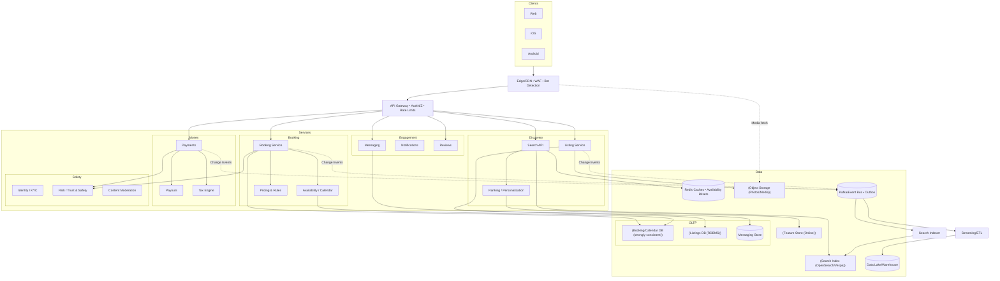

### Core Booking Flow

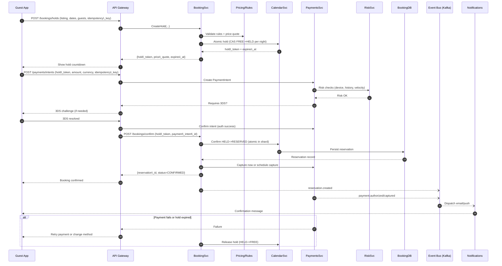

### Availability Hold Algorithm

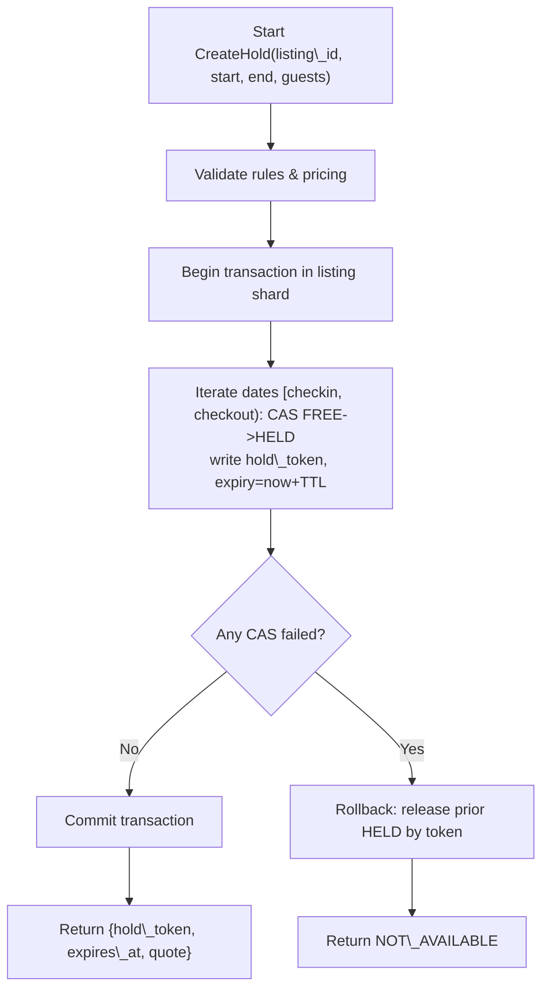

### Search Query Path

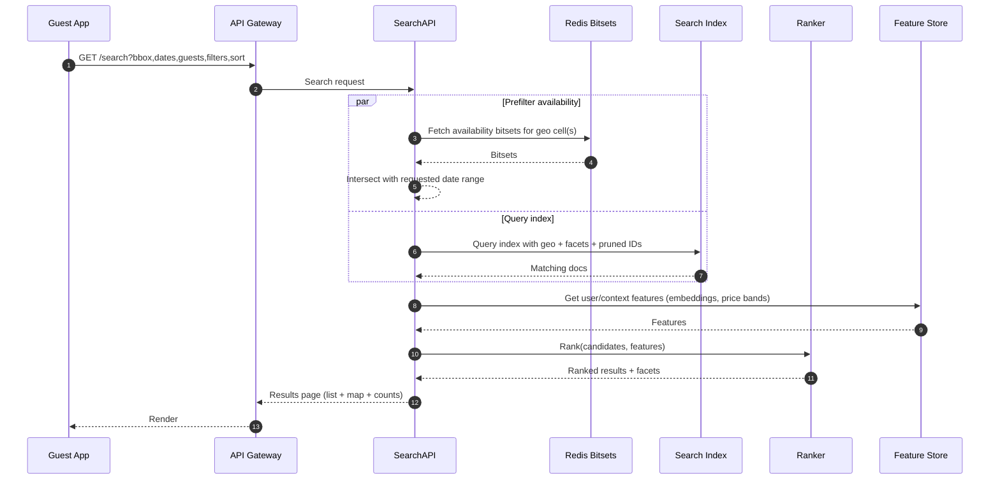

### Eventing, Outbox, and Indexing Pipeline (CQRS)

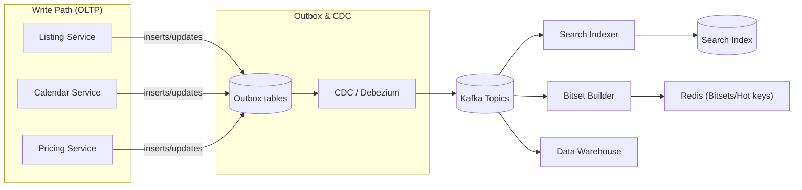

### Multi-Region Topology (Option A: Global Strongly-Consistent DB)

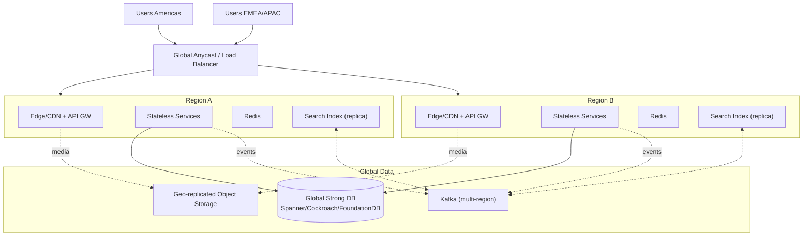

### Multi-Region Topology (Option B: Cell-Based Booking)

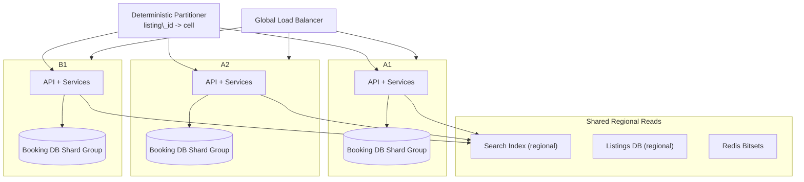

### Core Data Model (Entity-Relationship Diagram)

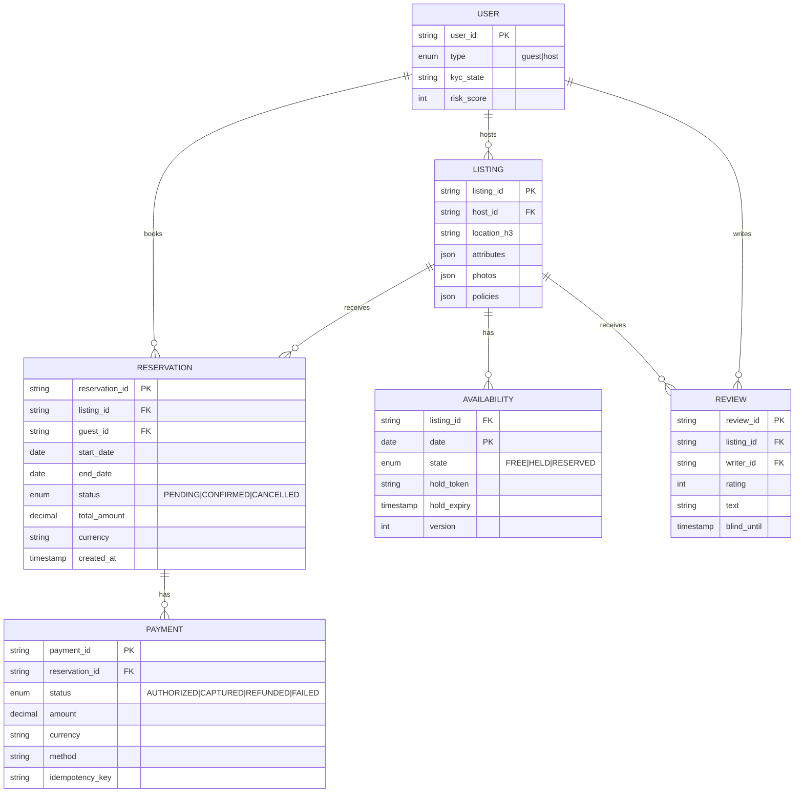

### Cancellation and Refund Saga

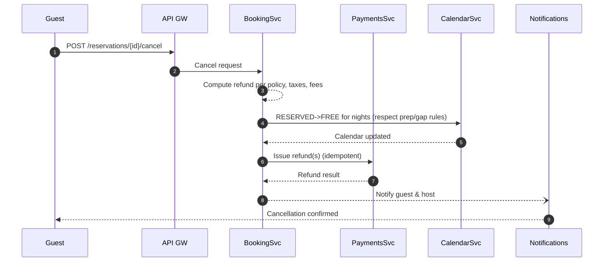

[Back to Top](#table-of-contents)

---

## Part VI: Search & Discovery Deep-Dive

## Search System: Detailed Design

Here's a deep-dive into Airbnb's Search & Discovery system with concrete data models, geo lookup design, availability filtering, ranking/personalization, caching, and operational choices. I’ve included Mermaid diagrams for dataflow and request lifecycles.

### Objectives and SLOs

* Relevance: High-precision recall of truly bookable listings for the user’s context.
* Latency: p95 < 300 ms end-to-end for typical searches; sub-150 ms map-pan updates.
* Freshness: Availability and price updates reflected in minutes (index) and seconds (bitsets).
* Scale: 100k RPS read path with burst tolerance; geo coverage global.

### Indexing: Document Design, Pipeline, and Shards

#### Search Document (Index Mapping Essentials)

* Keys
  + listing\_id (keyword), host\_id (keyword)
  + location: lat, lon (geo\_point)
  + h3\_cells\_r{7..10} (keyword multi-valued) for tiling and facets
* Text/browse fields
  + title\_{locale}, description\_{locale} (text with analyzers)
  + property\_type, room\_type, amenities[], policies[]
  + safety flags (instant\_book, superhost), cancellation\_policy
* Numeric/facets
  + nightly\_price\_base, cleaning\_fee\_base, fees\_base, currency
  + avg\_rating, rating\_count, quality\_score, conversion\_uplift
  + capacity fields: guests, bedrooms, beds, bathrooms
* Availability summary features for coarse prefiltering
  + next\_available\_date, availability\_ranges\_compact (compressed ranges, e.g., [start,end] pairs for the next 6 months up to a cap), availability\_density\_30/60/90
* Rank features
  + click\_ctr, save\_rate, cancellation\_rate, host\_response\_time, newness\_score, distance\_to\_center, price\_zscore\_in\_cell
* Denormalized city/region/place\_ids for filters and SEO

#### Indexing Pipeline

* Write path
  + Listing/price/calendar updates -> Outbox -> Kafka (topics: listing\_updated, price\_updated, calendar\_delta)
  + Search Indexer service consumes, fetches latest enriched state (Pricing snapshot, coarse availability ranges), transforms and upserts into OpenSearch/Vespa.
  + Calendar deltas: small and frequent. We don’t reindex full doc each hold; instead:
    - Update bitsets (Redis) in seconds.
    - Periodically (e.g., every 5–10 minutes or on material changes), update availability\_ranges\_compact in the index.
* Sharding
  + Primary shard key: listing\_id hash modulus (uniform).
  + Routing preference for geo: optionally co-route listings by H3 super-cell for locality, but ensure even shard sizes.
  + Replication: 2–3 replicas; cross-AZ. For multi-region, regional clusters fed from Kafka.

#### Availability Side-Channel (Fast, Exact Date Checks)

* For each listing: a 400-bit rolling window (next ~13 months), Roaring bitmap or bitset; 1=available night.
* Key: avail:{listing\_id} => bitmap + version + updated\_at
* Updates:
  + On reservation/hold/expiry: Booking/Calendar emits calendar\_delta -> Availability Updater updates Redis in ~1–2 s.
  + Nightly maintenance extends the rolling window.
* Rule masks
  + Precompute masks for min/max stay, allowed check-in weekdays, prep/buffer nights; compose via bitwise ops during query.
* Why this split
  + Index availability gives coarse pruning; Redis bitsets enforce correctness without hammering OLTP.

#### Indexing and Availability Side-Channel Diagram
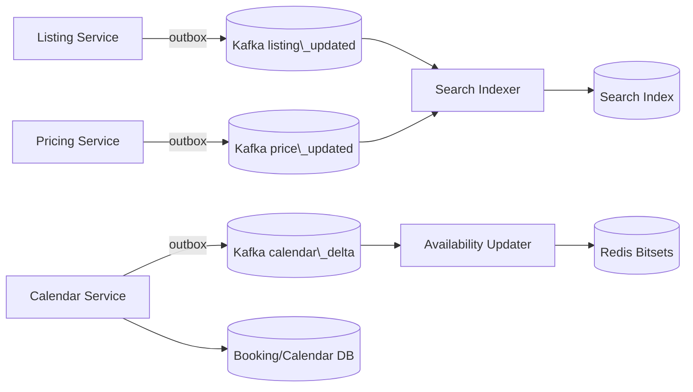

### Geolookup and Spatial Model

#### Place Resolution (Text to Place)

* Place DB: curated from OSM/Who’s On First/Geonames + provider (Mapbox/Google), with:
  + place\_id, type (country/region/city/neighborhood/POI), polygon (GeoJSON), bbox, centroid, aliases/transliterations, popularity.
* Geocoder service
  + /geo/resolve?q=“barcelona”&locale=es returns place\_id, polygon, bbox, display\_name, rank.
  + Fuzzy matching, typo tolerance, multi-lingual analyzers, popularity boosting.
* Reverse geocoding: map coordinate to enclosing places via polygon index.

#### Viewport and Tiling

* Use H3 grid for server-side tiling, typically res 7–9 depending on zoom.
* Map search
  + Client sends viewport polygon + zoom.
  + Server polyfills polygon into H3 cells at target resolution (adjust for area to cap cell count).
  + Use cells for:
    - fast doc routing (filter on h3\_cells\_rX terms)
    - server-side clustering and heatmaps
    - facet pre-aggregation caches keyed by cell

#### Geolookup and Viewport to Cells Diagram

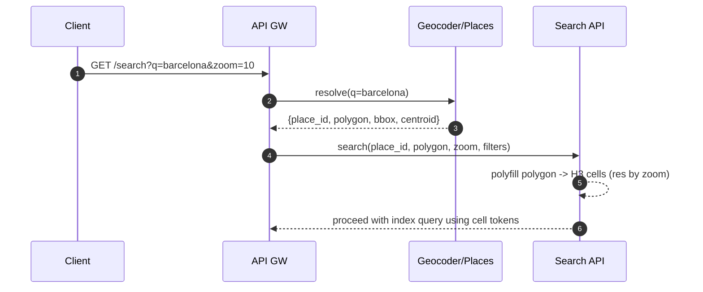

### Query Path (End-to-End)

#### Step-by-Step (Map or Place Search)

1. **Normalize request**
   * Resolve q to polygon (optional).
   * Compute H3 cells; clamp requested area to max cells; degrade resolution if necessary.
   * Normalize price filter to base or user currency; handle taxes display policy.
2. **Candidate retrieval (index)**
   * Query OpenSearch/Vespa with filters:
     + geo filter: h3\_cells\_rX terms or geo\_shape within polygon for precise boundary.
     + structural filters: capacity >= guests, amenities subset, property\_type, instant\_book, policies, rating >= X.
     + price filter in user currency using per-listing pre-indexed normalized\_price\_user\_ccy (updated daily or with FX trigger).
     + keyword text (optional) with BM25 or ANN for semantic search if needed.
   * Return top K’ candidates (e.g., 3000) by a fast recall rank (BM25 + static quality + distance + price prior), plus aggregations (facets, histograms).
6. Availability pruning (Redis bitsets)
   * Compute date mask M for requested [checkin, checkout). Include rule masks (min stay, day-of-week, prep).
   * Fetch bitsets for candidates in parallel (pipelined across Redis shards).
   * Keep those where (bitset AND M) contains a contiguous run covering (nights).
   * Adaptive widening: If < page\_size after prune, increase K’ and repeat one time.
7. Scoring and ranking
   * Fetch personalization features (Feature Store).
   * Compute score = p(book|user, listing, context) via LTR model; calibrate per geo and device.
   * Apply diversity constraints (price bands, neighborhoods, property types) via greedy MMR/submodular optimization.
5. **Pagination and caching**
   * Build stable cursor using top-N candidate IDs + index sort key; store in short-lived cache to ensure consistent paging.
   * Cache result for anonymous queries by (cells, dates, guests, filters, sort) with 10–30s TTL; signed-in queries are partially cacheable (strip personalized effects for shared cache).
6. **Response**
   * Return list results + map clusters + facet counts + price histogram.

#### Query Pipeline Diagram

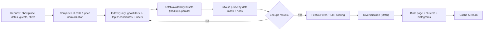

### Availability Bitset Check Details

* Mask building
  + Nights = days between checkin and checkout in listing’s local timezone.
  + M = contiguous bits for those nights.
  + Apply:
    - min\_stay: require nights >= min
    - max\_stay: nights <= max
    - allowed\_checkin\_days: zero out bits if start day invalid
    - prep\_time: additionally require adjacent buffer nights be free (check extra bits).
* Efficient contiguous-run check
  + Precompute also a prefix-sum/next-zero index per bitset chunk or do O(1) with bit tricks on machine words in Lua script running inside Redis (optional).
* Consistency vs holds
  + Bitsets updated on hold/confirm/release; TTL sweeper ensures expired holds clear. Index might lag but Redis is source of truth for availability at search time.

### Ranking and Personalization

#### Recall vs Rank

* Recall model (in index): inexpensive combination of BM25/ANN + static priors (quality\_score, proximity, price\_zscore).
* LTR ranker: GBDT or DNN
  + Features
    - Listing: price\_normalized, rating\_count, avg\_rating, cancellation\_rate, superhost, instant\_book, novelty\_age, photo\_quality, distance\_to\_interest.
    - User: embeddings (collaborative), price\_sensitivity, party\_size, device locale, recency of travel, typical length-of-stay, “adventurous vs mainstream” profile.
    - Context: seasonality index, market demand, lead time, weekday/weekend, stay length, special events.
    - Interaction: dwell time on card, saves/wishlists, similar-listings clicks.
  + Training data
    - Labels from bookings (primary), add clicks/saves as weak labels; counterfactual corrections and propensity scoring; time decay.
  + Objectives
    - Maximize calibrated p(book) while honoring constraints (fairness/exploration).

#### Diversification and Fairness
* MMR/submodular: maximize score + lambda \* diversity distance with constraints:
  + avoid near-duplicate homes
  + ensure price spread, neighborhood spread
  + host fairness (avoid saturating with one superhost)
* Exploration
  + Apply epsilon-greedy or Thompson sampling on top 10–20 to discover new listings with uncertainty bonus.
* Guardrails
  + Risk/quality constraints: penalize high cancellation\_rate, low response, policy violations.

### Caching Strategy

* Edge caching
  + Anonymous browse pages and map tiles with short TTL (10–30s) keyed by tile+filters (excluding dates for extreme variability unless very common ranges, e.g., next weekend).
* Mid-tier caches (Redis)
  + Availability bitsets (primary)
  + Popular H3 cell facet snapshots: counts, price histogram buckets for common filters; refreshed via background worker using Kafka change signals.
  + Search page results cache for hot queries; shard-aware to avoid thundering herds.
* Client caching
  + Debounce map move; send requests at most every 150–250 ms when dragging.
  + Reuse last candidate set for small viewport changes.

### API Design (Key Endpoints)

* GET /search
  + Params: q, place\_id, bbox, zoom, start\_date, end\_date, guests, infants, pets, filters (amenities[], room\_type, property\_type, instant\_book, cancellation), price\_min/max (user currency), sort, page\_cursor, page\_size
  + Response: listings[], clusters[], facets, price\_histogram, cursor, diagnostics (timings)
* GET /search/tiles
  + Params: bbox or tile\_ids[], zoom, filters, dates (optional)
  + Response: per-tile counts, top-N exemplars
* GET /suggest
  + Typeahead for places and neighborhoods
* GET /similar/{listing\_id}
  + Uses embedding KNN and market constraints

### Pricing and Currency Handling

* Normalize price filters into user currency:
  + price\_normalized = price\_host\_currency \* fx\_rate[host->user]
  + fx\_rate updated multiple times per day; index stores price\_normalized for top 20 currencies; fallback convert at query-time for rare currencies.
* Ranking uses price\_zscore within cell to avoid absolute price bias.

### Facets and Aggregations at Scale

* Index aggregations:
  + amenity counts, property\_type counts, instant\_book counts
  + price histogram: precomputed bucket edges per market to reduce error
* Cell-level caches:
  + For hot markets, maintain Redis entries: cell:{res}:{cell\_id}:{filter\_signature} -> {counts, price\_hist} with 30–120s TTL.
  + Update via change events (listing on/offline) and periodic refresh.

### Multi-Region and Freshness

* Each region runs a search cluster with local replicas; Kafka topics are mirrored.
* Availability Redis is regional; cross-region replication optional since search is routed to nearest region; booking correctness relies on calendar DB not search.
* SLA
  + Calendar delta -> Redis: p95 < 2s.
  + Listing change -> Index: p95 < 5m; urgent flags (suspend listing) trigger fast-lane reindex (< 30s).

### Observability and Quality

* Per-query diagnostics: timings for resolve, index, bitsets, rank, cache status
* Quality dashboards: nDCG@k, book-through-rate, coverage, diversity metrics, bad-click rate
* Online experiments: assignment service; guardrails for conversion, cancellations, CS contacts

### Pseudocode: Server-Side Search

```
function search(req):
  ctx = normalize(req)  // resolve place, currency, H3 cells, dates
  sig = cacheKey(ctx, exclude_personalization=true)
  if cache.exists(sig): return cache.get(sig)

  candidates, aggs = index.query(
      geo = ctx.cells or ctx.polygon,
      filters = ctx.filters,
      price = ctx.price_range_normalized,
      size = K_PRIME)

  mask = build_date_mask(ctx.start, ctx.end, ctx.listing_timezone_hint)
  avail_ok = []
  for batch in batchByShard(candidates.ids):
      bitsets = redis.mget(batch.ids)
      for id in batch.ids:
          if contiguous_run(bitsets[id] & mask) >= ctx.nights: avail_ok.add(id)

  if len(avail_ok) < ctx.page_size:
      candidates2 = index.query(..., size = K_PRIME * 2)
      // repeat prune for additional candidates

  feats = featureStore.fetch(user=ctx.user, listings=avail_ok.top(N_FEATURES))
  scored = ranker.score(avail_ok, feats, ctx)
  ranked = diversify(scored, constraints=ctx.diversity)
  page = paginate(ranked, ctx.cursor)

  result = buildResponse(page, aggs, clusters(ctx.cells, ranked), diagnostics)
  cache.set(sig, result, ttl=20s)  // anonymous-safe
  return result
```

### End-to-End Search Flow with Caching and Adaptive Widening

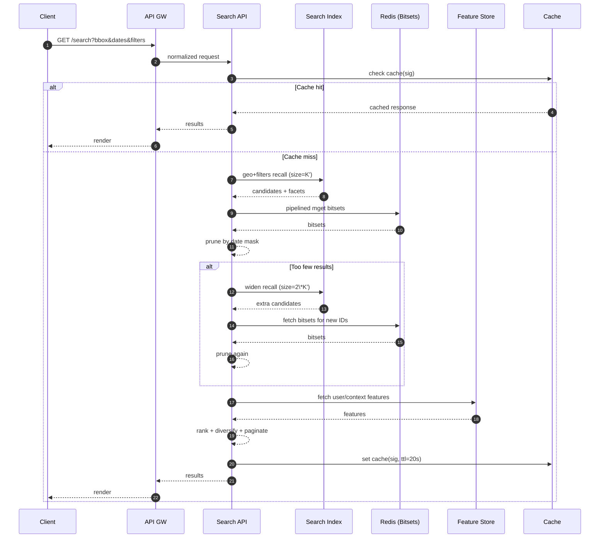

### Operational and Failure Modes

* Degraded mode: If Redis bitset service is impaired, fallback to index-only availability\_ranges\_compact with a small false-positive rate; label results with “availability may have changed”.
* Backpressure: If index latency > SLO, reduce K’ and prefer cached cell results; increase result TTLs temporarily.
* Hotspots: Popular markets → pre-warm caches, shard pinning for high-density cells, autoscale search nodes with headroom.

### Key Trade-offs

* Doing precise date validation in Redis keeps index lean and avoids heavy nested ranges, while index still carries coarse range summaries for degraded mode and early pruning.
* H3-based tiling yields stable, cacheable partitions and cheap aggregation, while still allowing precise geo\_shape when necessary.
* Adaptive widening balances result quality with query latency.

[Back to Top](#table-of-contents)

---

## Appendix: Open Questions

### Open Questions to Tailor Further

* Do you want Experiences integrated in v1 or later?
* Preference for a global strongly-consistent DB vs cell-based regional booking?
* Target cloud(s) and existing PSP preferences?
* Adapt for specially the booking/DB choices and sketch a reference deployment topology with concrete tech picks?
* Elaborate more on concrete OpenSearch mappings, example H3 resolutions per zoom level, or the LTR feature dictionary and training cadence for your markets?

[Back to Top](#table-of-contents)
